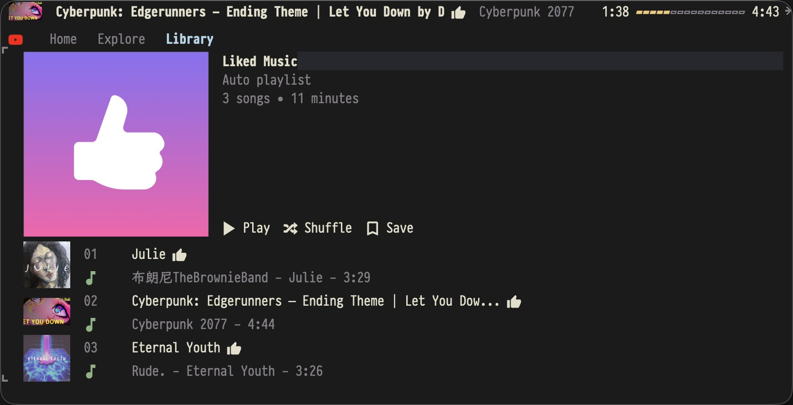

# ytm-radio

An experimental Emacs audio player for YouTube and YouTube Music.

`yt-dlp` discovers URL metadata for transient URL playback, and `mpv` plays
audio with video disabled. Emacs owns playback state, selection commands, and
the YouTube Music browser UI.

The UI is Emacs-native: regular `special-mode` buffers plus optional
side-window and child-frame now-playing views. Terminal Emacs is supported
through those Emacs surfaces; ytm-radio does not provide or target a standalone
terminal TUI outside Emacs.

YouTube Music account access is a separate Rust CLI. It is not an Emacs
dynamic module and does not run as a resident service. Emacs starts one
process for a request, reads a versioned JSON response, and the process exits.




## Status

Implemented:

- play YouTube and YouTube Music URLs transiently through `yt-dlp`;
- normalize playlists, channels, and tracks into a local catalog;
- play through `mpv --no-video`;
- pause, next, previous, stop, and seek through mpv IPC;
- show YouTube Music browse pages in a regular buffer;
- show the current cover, playback progress, and controls in child-frame,
  side-window, or regular-buffer now-playing views;
- expose current-track actions through a transient menu;
- invoke an external Rust account helper;
- import YouTube Music auth through a browser login window and the
  browser's DevTools protocol;
- make authenticated YouTube Music home, explore, library, liked, detail,
  search, radio/mix, playlist mutation, rating, track status, library
  mutation, item library, and subscription requests;
- normalize live music renderers into playable tracks;
- preserve non-track YouTube Music items such as albums, artists, playlists,
  and recommendation cards when they are present in browse responses;
- render Home, Explore, Library, Search, detail, and queue views as
  Emacs-native sections;
- preserve browser positions across root-view switches and back navigation;
- cache helper bootstrap data and short-lived account API responses;
- save/remove library tracks, add tracks to playlists, start mixes, save/remove
  detail albums and playlists, subscribe/unsubscribe detail artists and channels,
  and manage the runtime queue from current-track actions;
- reject unsupported helper schema, protocol, and binary versions.

Not implemented yet:

- complete detail-page coverage for every YouTube Music renderer shape;
- encrypted credential storage;
- durable offline account catalog beyond the saved browser state and
  short-lived helper response cache;
- full renderer coverage for every YouTube Music web card type.

The live API is an unofficial YouTube Music web protocol and can change without
notice. The helper dynamically reads current client configuration from the
YouTube Music page instead of hardcoding the API key.

## Requirements

- Emacs 29.1 or newer
- `transient`
- `yt-dlp`
- `mpv`
- a Rust toolchain only when building the account helper locally

No Python runtime or Python package is used.

## Setup

Load the Emacs package:

```elisp
(add-to-list 'load-path "/Users/luciuschen/repos/ytm-radio")
(require 'ytm-radio)
```

Install the account helper from the latest GitHub release:

```text
M-x ytm-radio-install-helper
```

You can also just run `M-x ytm-radio`. When account-backed data is first needed
and no helper is available, ytm-radio asks whether to download the matching
helper release. Confirm the prompt to install the helper and continue the
original action.

Opening `M-x ytm-radio` does not prompt for a URL when the catalog is empty.
When account access is needed, ytm-radio opens the login flow automatically.
Use `H`, `E`, `L`, `/`, or `a` to browse account pages, search, or add a URL.

The main `*ytm-radio*` buffer is the YouTube Music browser. It renders Home,
Explore, Library, Search, and URL-backed pages as vertical Emacs sections with
compact track/card rows. Home and Explore preserve YouTube Music modules such
as listen-again, mixed-for-you, albums, playlists, and artists when the web
response includes them. Library renders its songs, albums, artists, and
playlists sections. Liked Music is not exposed as a browser entry or shown as a
Library root section. UI rows truncate instead of visually wrapping
in narrow windows, so long titles do not disturb the list layout. Click Home,
Explore, or Library in the header line to switch root views;
the `H`, `E`, and `L` keys provide the same navigation.
Home, Explore, and Library use cached sections first and only load asynchronously
when a view has no cached data or when explicitly refreshed. Home continuation
pages load lazily when the visible Home buffer reaches the rendered end, and the
next Home continuation token is stored with the durable browser state.
Thumbnail downloads in large browser views are capped per render to reduce UI
jank while covers are still loading. Customize
`ytm-radio-browser-thumbnail-downloads-per-render` to change the batch size, or
set it to nil to disable the cap.

The default child frame is a compact, non-focusable now-playing surface. In a
graphical display it fits itself to the current cover image, shows title,
artist, time, and progress, and exposes the core playback controls without
turning the child frame into the main browser. Click the transport buttons to
control playback or drag any non-button area of the graphical child frame to
move it for the current now-playing session. Set
`ytm-radio-child-frame-draggable` to nil to disable dragging.

In terminal Emacs, `child-frame` uses Emacs's TTY child-frame support when
available, detected with `(featurep 'tty-child-frames)`. That support requires
newer Emacs builds. When TTY child frames are unavailable or rejected by the
terminal, ytm-radio falls back to a regular now-playing buffer. Terminal child
frames omit cover placeholders because cover images are unavailable there.

Set `ytm-radio-display-style` to `side-window` to show now-playing as a compact
top side window instead. The side-window style appears once per frame, reserves
real layout space, and avoids reusing Emacs's tab bar for non-tab content. This
style works in both graphical and terminal Emacs; terminal Emacs shows text and
icon fallbacks instead of cover images. The content stays on one row: narrow
frames keep the track and progress visible and hide the playback controls
instead of wrapping.

```elisp
(setq ytm-radio-display-style 'side-window)
```

`M-x ytm-radio-install-helper`, or the first-use confirmation prompt, downloads
the helper release matching the Elisp package version, verifies its published
SHA-256 digest, and installs the platform-specific binary to:

```text
~/.ytm-radio/bin/ytm-radio-helper
```

Release downloads currently support macOS arm64, macOS x86_64, Linux x86_64,
and Windows x86_64. On Windows, the installed helper file is
`ytm-radio-helper.exe`.

When developing from a checkout, you can also build the helper locally:

```sh
cargo build --manifest-path helper/Cargo.toml
```

The in-repository helper path is:

```text
helper/target/debug/ytm-radio-helper
```

ytm-radio uses the configured `ytm-radio-helper-command` when it is executable.
If the default in-repository helper is missing, it falls back to the installed
release helper or offers to install it interactively. Set
`ytm-radio-helper-command` explicitly when installing the binary elsewhere:

```elisp
(setq ytm-radio-helper-command
      "/absolute/path/to/ytm-radio-helper")
```

Disable the first-use install prompt if you want missing helpers to fail with a
diagnostic instead:

```elisp
(setq ytm-radio-helper-offer-install nil)
```

Run `M-x ytm-radio-doctor` when playback, login import, or account browsing
does not start. It reports whether the helper, `mpv`, `yt-dlp`, the runtime
directory, and the auth file are visible from Emacs.

## Commands

- `M-x ytm-radio` opens the YouTube Music browser buffer.
- `M-x ytm-radio-doctor` shows a setup diagnostic report.
- `M-x ytm-radio-install-helper` downloads the helper binary from GitHub
  Releases.
- `M-x ytm-radio-home` switches to Home.
- `M-x ytm-radio-explore` switches to Explore.
- `M-x ytm-radio-library` switches to Library.
- `M-x ytm-radio-add-url` plays a YouTube or YouTube Music URL asynchronously.
- `M-x ytm-radio-import-ytmusic-library` imports library sources.
- `M-x ytm-radio-import-ytmusic-home` imports home recommendations.
- `M-x ytm-radio-more` opens hidden items in the current section.
- `M-x ytm-radio-load-more-home` imports the next Home continuation page.
- `M-x ytm-radio-import-ytmusic-explore` imports explore sections.
- `M-x ytm-radio-refresh` refreshes the current browser view.
- `M-x ytm-radio-search` searches YouTube Music.
- `M-x ytm-radio-now-playing` shows or hides the configured now-playing view.
- `M-x ytm-radio-queue` shows the current runtime playback queue.
- `M-x ytm-radio-play-track` selects a known track.
- `M-x ytm-radio-play-source` selects a known source.
- `M-x ytm-radio-current-actions` opens actions for the current track.
  Stateful actions such as repeat, shuffle, like, dislike, and library show
  their current state in the menu labels.
- `M-x ytm-radio-like-current-track` likes the current track or clears an
  existing like.
- `M-x ytm-radio-dislike-current-track` dislikes the current track or clears an
  existing dislike.
- `M-x ytm-radio-toggle-current-track-library` saves or removes the current
  track from the YouTube Music library.
- `M-x ytm-radio-toggle-detail-library` saves or removes the current album or
  playlist detail from the YouTube Music library.
- `M-x ytm-radio-toggle-detail-subscription` subscribes or unsubscribes the
  current artist/channel detail.
- `M-x ytm-radio-start-current-track-mix` starts a YouTube Music mix queue from
  the current track.
- `M-x ytm-radio-add-current-track-to-playlist` adds the current track to a
  selected YouTube Music playlist.
- `M-x ytm-radio-play-current-track-next` inserts the current track after the
  current runtime queue position.
- `M-x ytm-radio-add-current-track-to-queue` appends the current track to the
  runtime queue.
- `M-x ytm-radio-toggle-pause` toggles mpv pause.
- `M-x ytm-radio-cycle-repeat` cycles repeat off, all, and one.
- `M-x ytm-radio-toggle-shuffle` toggles shuffle playback.
- `M-x ytm-radio-stop` stops playback.
- `M-x ytm-radio-next` plays the next track.
- `M-x ytm-radio-previous` plays the previous track.
- `M-x ytm-radio-share` copies the current track URL.
- `M-x ytm-radio-seek-forward` seeks forward.
- `M-x ytm-radio-seek-backward` seeks backward.
- `M-x ytm-radio-hide-browser` hides the browser buffer.
- `M-x ytm-radio-hide-now-playing` hides the now-playing view.
- `M-x ytm-radio-hide` hides ytm-radio UI.

Inside the browser buffer:

| Key | Action |
| --- | --- |
| `a` | Add URL |
| `c` | Show or hide the now-playing view |
| `H` | Switch to Home |
| `E` | Switch to Explore |
| `L` | Switch to Library |
| `/` | Search YouTube Music |
| `RET` | Play a track or open the item/source at point |
| `j`, `k`, `Down`, `Up` | Move between item rows |
| `m` | Open more items for the current section |
| `g` | Refresh the current browser view |
| `TAB`, `S-TAB` | Move between sections |
| `b` | Return to the previous browser view |
| `s` | Play source at point, or select a source |
| `SPC` | Toggle pause |
| `n` | Next track |
| `p` | Previous track |
| `A` | Open current-track actions |
| `l` | Like the current track or clear an existing like |
| `d` | Dislike the current track or clear an existing dislike |
| `R` | Start mix from the current track |
| `P` | Add current track to a playlist |
| `t` | Save or remove current track from library |
| `S` | Copy current track URL |
| `Q` | Show the runtime queue |
| `f` | Seek forward |
| `B` | Seek backward |
| `q` | Hide the browser buffer |

Use `M-x imenu` in Home, Explore, or Library to jump between rendered
sections.

The graphical child frame is non-focusable: use its mouse transport buttons or
the browser buffer bindings above. When the now-playing buffer is selected in a
regular Emacs window, these local keys are available:

| Key | Action |
| --- | --- |
| `SPC` | Toggle pause |
| `n` | Next track |
| `p` | Previous track |
| `r` | Cycle repeat mode |
| `s` | Toggle shuffle |
| `A` | Open current-track actions |
| `l` | Like the current track or clear an existing like |
| `d` | Dislike the current track or clear an existing dislike |
| `R` | Start mix from the current track |
| `P` | Add current track to a playlist |
| `t` | Save or remove current track from library |
| `S` | Copy current track URL |
| `Q` | Show the runtime queue |
| `q` | Hide the now-playing view |

## Helper Contract

The CLI surface is:

```text
ytm-radio-helper auth check --auth FILE
ytm-radio-helper auth login-window --output FILE [--browser BROWSER] [--profile-dir DIR] [--port N] [--timeout-secs N] [--restart-running]
ytm-radio-helper version
ytm-radio-helper browse home --auth FILE [--limit N] [--initial-only]
ytm-radio-helper browse explore|library|library-songs|library-albums|library-artists|library-playlists|liked --auth FILE [--limit N]
ytm-radio-helper browse-id BROWSE_ID --auth FILE [--params PARAMS] [--limit N]
ytm-radio-helper continuation TOKEN --auth FILE [--limit N]
ytm-radio-helper search QUERY --auth FILE [--limit N]
ytm-radio-helper rate VIDEO_ID like|dislike|indifferent --auth FILE
ytm-radio-helper radio VIDEO_ID --auth FILE [--limit N]
ytm-radio-helper playlist-options VIDEO_ID --auth FILE
ytm-radio-helper add-to-playlist VIDEO_ID PLAYLIST_ID --auth FILE
ytm-radio-helper library VIDEO_ID toggle|save|remove --auth FILE
ytm-radio-helper item-library BROWSE_ID toggle|save|remove --auth FILE [--params PARAMS]
ytm-radio-helper subscription BROWSE_ID toggle|subscribe|unsubscribe --auth FILE [--params PARAMS]
ytm-radio-helper track-status VIDEO_ID --auth FILE
```

For `home`, `explore`, and `library`, the helper preserves YouTube Music
sections and returns each section as a source. `browse home --initial-only`
returns only the first Home page plus a continuation token. `continuation TOKEN`
loads the next Home section page. The limit applies per section.
The explicit library subtargets return focused sources for songs, albums,
artists, playlists, and liked music. `search` returns a source containing mixed
result items.
`browse-id` is used internally by the Emacs UI to expand albums, artists, and
playlists without sending YouTube Music-only pages through yt-dlp. When YouTube
Music returns endpoint `params`, the Emacs UI passes them through `--params`
because some playlist and mix pages reject a bare `browseId`.
`rate` is used by the current-track actions menu and maps to YouTube Music's
like, dislike, and remove-rating endpoints.
`VIDEO_ID` arguments must be 11-character YouTube video ids.
`radio` loads a YouTube Music mix queue from a seed video id.
`playlist-options` returns writable playlists for a video, and
`add-to-playlist` adds the video to the selected playlist.
`library` toggles, saves, or removes the current song through YouTube Music
feedback tokens fetched by the helper. `item-library` does the same for album
and playlist detail pages, using a feedback token when one is present and the
playlist/album rating endpoint otherwise. `subscription` toggles artist/channel
subscriptions from a detail browse id. Detail library and subscription mutations
return the requested target state as soon as YouTube Music accepts the mutation;
they do not wait for a second detail fetch to verify eventual consistency.
`track-status` reads the current account
like/dislike and library state without mutating the song; the Emacs UI uses it
to refresh the current track after playback starts. When rating state is not
available, `track-status` omits `like-status`; a present JSON null means the
track is known to be unrated.

URL playback remains a general `yt-dlp` compatibility path. It is transient and
does not store YouTube Music menu tokens. Actions that need YouTube Music
account state are intended for YouTube Music helper-backed tracks and detail
pages.

Responses use a stable envelope:

```json
{
  "ok": true,
  "schema": 1,
  "protocol": 1,
  "helper-version": "0.1.5",
  "data": {
    "sources": []
  },
  "warnings": []
}
```

Failed helper commands also write a versioned JSON envelope to stdout and exit
non-zero. Its `error` object includes a stable `code`, human-readable `message`,
and `retryable` and `auth-required` flags. Error metadata is assigned where the
failure occurs rather than inferred from message text. Help output is returned
inside the same successful JSON envelope. Diagnostics remain on stderr.

## Login

There is no separate login command in normal use. When `M-x ytm-radio` opens an
uncached account-backed view, or when Home, Explore, Library, Search, or a
detail page needs account access, ytm-radio opens the browser login flow
automatically. After login succeeds, ytm-radio resumes the action that required
account access.

If the helper reports that an existing auth file is rejected, for example with
HTTP 401 Unauthorized or HTTP 403 Forbidden, ytm-radio clears account-derived
cache, opens the same login flow, and retries the original action after login.

ytm-radio opens the login browser at `https://music.youtube.com`. Sign in there
if needed. The helper waits for the logged-in YouTube Music page to expose
cookies and page context, then writes the auth JSON.

The login browser must be started with a local remote-control endpoint. If you
opt into the browser's normal profile and that browser is already running
without the endpoint, ytm-radio asks before restarting it once. Chrome uses a
helper-managed non-default profile when needed to satisfy Chrome's DevTools
profile requirement.

The login flow:

1. opens the login browser with a local remote-control endpoint;
2. waits for sign-in to finish;
3. reads cookies and `ytcfg` page context through the browser protocol;
4. writes a private JSON file with mode `0600` on Unix;
5. clears the helper bootstrap and response caches;
6. refreshes Home asynchronously.

The default output is:

```text
~/.ytm-radio/auth.json
```

Runtime data defaults to `~/.ytm-radio/`: `auth.json` stores the helper session,
`bootstrap-cache.json` stores non-secret YouTube Music client bootstrap data,
`response-cache/` stores short-lived helper API responses scoped by account,
`state.eld` stores imported sources and the last track, and `covers/` caches
cover images. The helper refreshes `bootstrap-cache.json` automatically when it
is missing, invalid, or older than 12 hours. Helper API responses use short TTLs
and are cleared after login refresh. If default
`~/.emacs.d/ytm-radio/auth.json` or `state.eld` files already exist from an
older checkout, ytm-radio copies them into the new directory on first startup.

By default, ytm-radio opens the system default browser when that browser has a
supported login flow. Chromium-based browsers use the DevTools protocol;
Firefox and Zen use WebDriver BiDi. On macOS this uses the default application
for `https://` URLs. On Linux this uses the default
`x-scheme-handler/https` desktop entry.

Set a preferred login browser when the default browser is unsupported or when
you want a specific browser. Use `chrome`, `brave`, `edge`, `chromium`,
`firefox`, `zen`, `dia`, or an executable path:

```elisp
(setq ytm-radio-helper-login-browser "chrome")
```

By default, only Chrome uses an isolated profile next to the auth file when no
explicit profile is configured. With the default auth file, that is
`~/.ytm-radio/login-profile/`. Other supported browsers, including Dia,
Firefox, and Zen, use their normal profile. Chrome 136 and newer do not enable
DevTools for the default Chrome profile. If you want a specific isolated login
profile for any supported browser, set:

```elisp
(setq ytm-radio-helper-login-profile-directory
      "~/.ytm-radio/custom-login-profile/")
```

Set `ytm-radio-helper-login-profile-directory` to nil to use the helper's
browser-specific default behavior.

Firefox and Zen are supported through WebDriver BiDi. If the selected browser
is already running without the helper's remote control port, close it before
login or configure an isolated profile directory so ytm-radio can start a
separate instance.

The default local browser remote-control port is `29317`:

```elisp
(setq ytm-radio-helper-login-cdp-port 29317)
```

The default login timeout is 180 seconds:

```elisp
(setq ytm-radio-helper-login-timeout 180)
```

The default file is reused automatically in future Emacs sessions. For a
custom location:

```elisp
(setq ytm-radio-helper-auth-file
      "~/.ytm-radio/custom-auth.json")
```

The auth file may contain account session material. Keep it out of git and
never store its contents in Emacs state.

Set `YTM_RADIO_TIMINGS=1` before starting Emacs to make the Rust helper print
bootstrap and YouTube Music request timings to stderr. Successful helper stdout
remains machine-readable JSON.

## Protocol References

- [Chrome DevTools Protocol](https://chromedevtools.github.io/devtools-protocol/)
- [ytmusicapi browser authentication](https://github.com/sigma67/ytmusicapi/blob/master/ytmusicapi/auth/browser.py)
- [ytmusicapi browsing requests](https://github.com/sigma67/ytmusicapi/blob/master/ytmusicapi/mixins/browsing.py)

## Proxy

Set one proxy URL when YouTube Music requests should go through a proxy:

```elisp
(setq ytm-radio-proxy-url "socks5h://127.0.0.1:7890")
```

The proxy is passed to the Rust helper, `yt-dlp`, and mpv's ytdl hook. HTTP and
HTTPS proxy URLs are also used for Emacs cover downloads and passed to mpv for
direct media URL playback.

When ytm-radio starts a Chromium-compatible login browser, the helper also
launches it with that proxy by passing a browser process argument. ytm-radio does
not rewrite Firefox or Zen profile preferences for WebDriver BiDi login, and it
does not alter already-running browser sessions. Firefox and Zen login windows
and existing browser sessions must use the browser or system proxy
configuration. When a SOCKS proxy is configured, ytm-radio avoids using cached
direct media URLs because mpv's direct transport may not preserve SOCKS routing.

## URL Cookies

These options are for `yt-dlp` media discovery and mpv playback only. They are
not used for ytm-radio account login.

Configure discovery-time `yt-dlp` options:

```elisp
(setq ytm-radio-yt-dlp-extra-args
      '("--cookies-from-browser" "chrome"))
```

Configure mpv's ytdl hook:

```elisp
(setq ytm-radio-ytdl-raw-options
      '("cookies-from-browser=chrome"))
```

ytm-radio asks mpv's ytdl hook for audio-only formats by default. This reduces
startup work for YouTube Music playback:

```elisp
(setq ytm-radio-mpv-ytdl-format "bestaudio/best")
```

Set it to nil to use mpv's default ytdl format selection:

```elisp
(setq ytm-radio-mpv-ytdl-format nil)
```

ytm-radio enables a conservative mpv network cache by default for long YouTube
Music tracks while avoiding an initial cache pause:

```elisp
(setq ytm-radio-mpv-network-cache-args
      '("--cache=yes"
        "--cache-pause=no"
        "--demuxer-readahead-secs=60"
        "--demuxer-max-bytes=256MiB"))
```

When playback starts, ytm-radio also pre-resolves the next track's direct audio
stream URL in the background.  This keeps browsing responsive while allowing the
next track to start faster when the cached stream URL is still valid:

```elisp
(setq ytm-radio-stream-prefetch-limit 1)
```

Set `ytm-radio-mpv-extra-args` to override these values when needed. Extra args
are passed after the default playback args, so mpv's later option wins.

## Development

Run all deterministic checks:

```sh
make check
```

This byte-compiles Elisp, runs ERT, checkdoc, package-lint, Rust formatting,
Clippy, and unit tests.

## License

ytm-radio is licensed under GPL-3.0-or-later. See [LICENSE](LICENSE).
